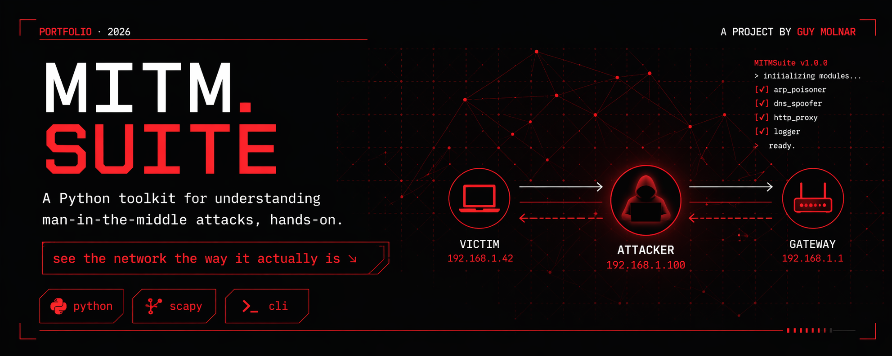
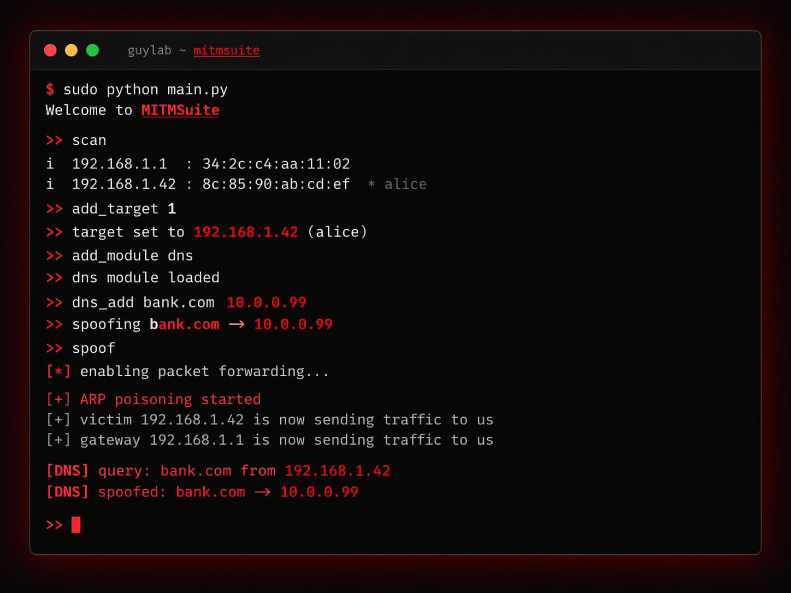

## Overview

MITMSuite is a Python-based man-in-the-middle attack toolkit with a terminal REPL interface, built for understanding network security hands-on.

## Requirements

- Python 3.x
- Scapy
- Npcap (Windows) / libpcap (Linux)
- Run as administrator/root

## Installation

```bash
git clone https://github.com/yourusername/MITMSuite.git
cd MITMSuite
pip install scapy
```

## Usage

```bash
sudo python main.py
```

## Commands

| Command | Description |
|---|---|
| `scan` | Scan the network for devices |
| `add_target <index>` | Set a target by index |
| `targets` | Show current targets |
| `add_module <name>` | Load a module (`dns`, `proxy`, `logger`) |
| `dns_add <domain> <ip>` | Add a DNS spoof rule |
| `spoof` | Start ARP spoofing |
| `stop` | Stop spoofing and restore ARP tables |

## Modules

- **logger** — Logs all intercepted packets to a timestamped file
- **dns** — Intercepts and spoofs DNS queries
- **proxy** — Inspects HTTP traffic and POST parameters

## Stack

- Python
- Scapy
- CLI
